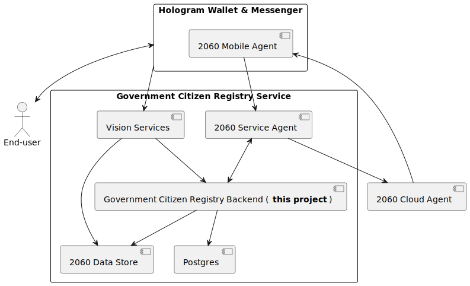
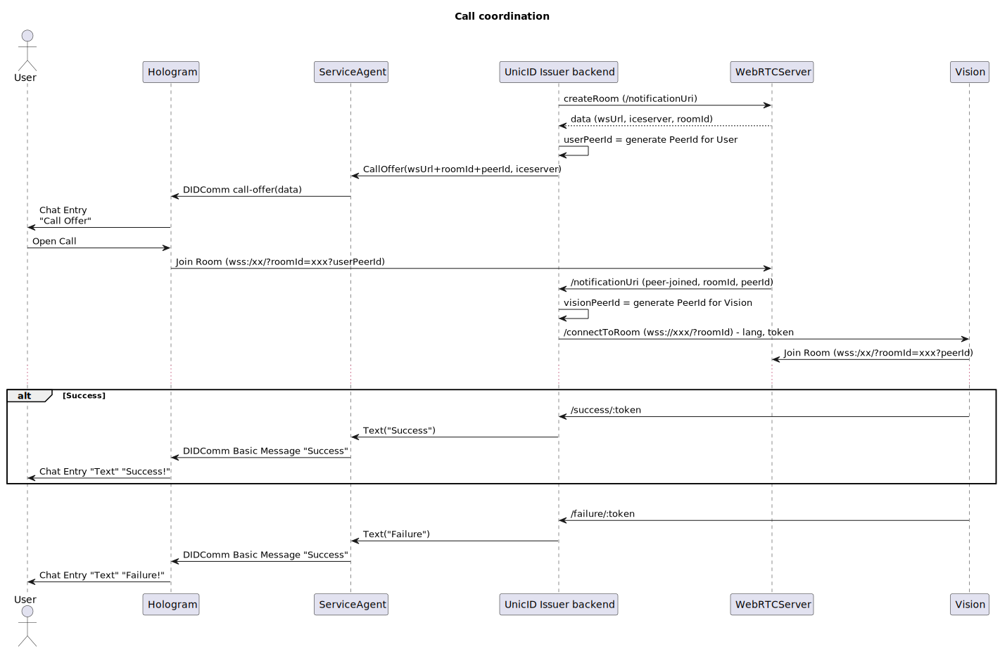
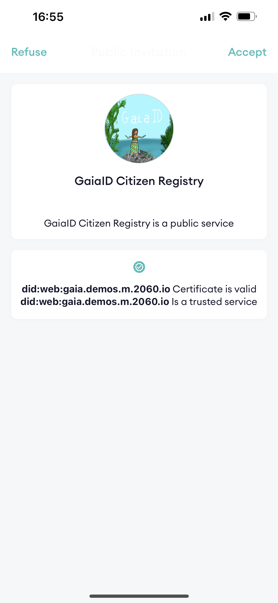
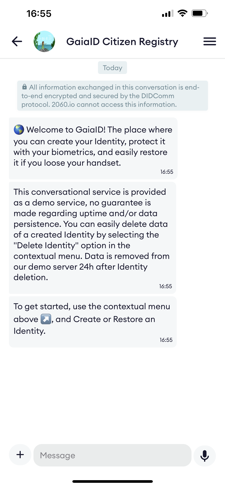
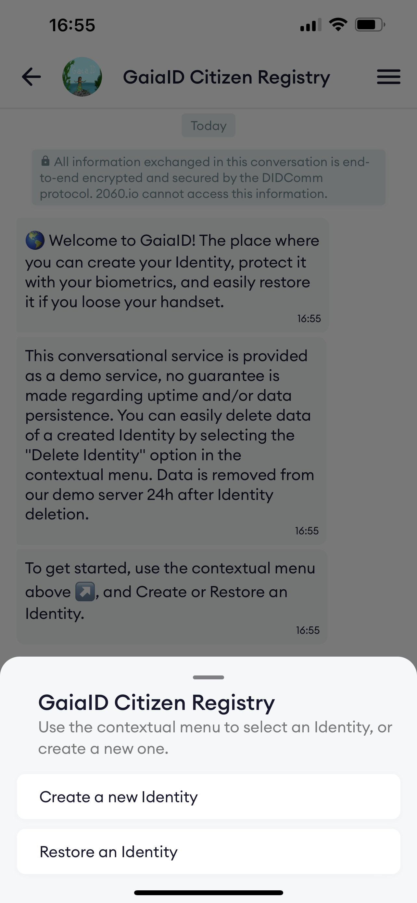
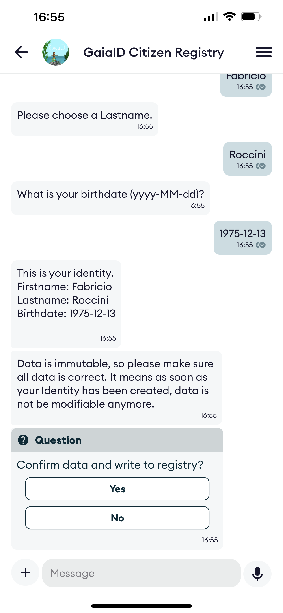
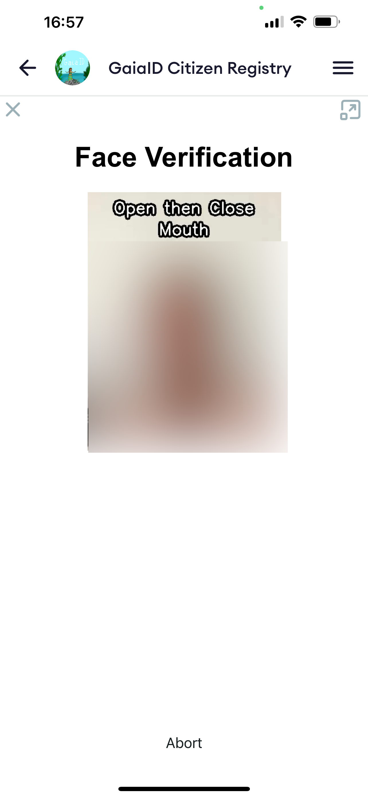
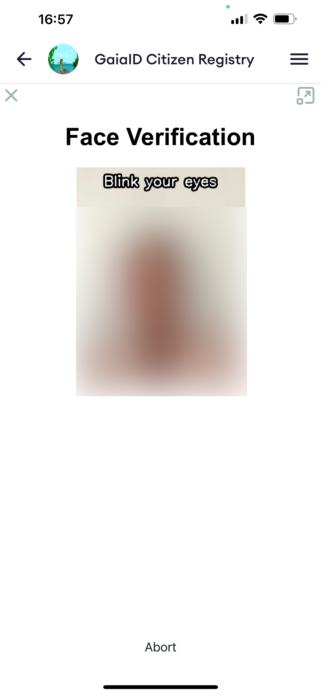
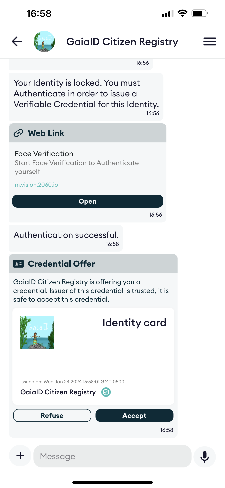
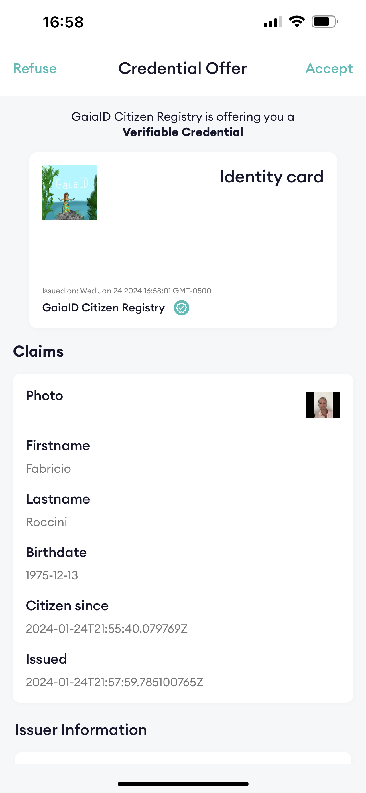

# UnicID Issuer DTS

## Purpose of the service

A DIDcomm conversational services (chatbot) to issue UnicID Verifiable Credentials to citizens by verifying their face against their NFC-compatible ID card.

## Device lost, app uninstalled?

If you lose you cellphone or delete the App, then can restore your Identity by simply re-connecting to the same Registry service, verifying your face, and recover your Verifiable Credential.

## Service Architecture

## Call coordination flow

### Unicid Identity Registry

a government-like registry service. Test URL: [https://gaiaid.io](https://gaiaid.io)

#### Scan the QR code

#### Accept the Invitation
<kbd>

</kbd>

#### Create the Identity

Go to contextual menu and select "Create an Identity"

<kbd>

</kbd>

#### Capture your face

<kbd>

</kbd>

#### Verify your face

Now you verify your face, just to be sure capture was OK.

<kbd>

</kbd>

#### Receive your ID Card

<kbd>

</kbd>

### AvatarID Registry

create your Avatar and protect it with your face biometrics. Test URL: [https://avatar.demos.2060.io/qr](https://avatar.demos.2060.io/qr)

Service is similar to the GaiaID one.

## Deploy your own demo for your country

Go to the [kubernetes-howto](kubernetes/README.md) section.

## Setting up a development environment

Please refer to [these instructions](docker-dev/README.md).
