# Hologram Government Digital ID Issuer

**Hologram Gov ID Issuer** is an application that, alongside [VS Agent](https://github.com/2060-io/vs-agent) and other open source components developed by [2060.io](https://2060.io), conforms a **DIDcomm conversational [Verifiable Service](https://verana-labs.github.io/verifiable-trust-spec/#what-is-a-verifiable-service-vs)** which issues Digital ID Credentials based on users' **real ID documents**.

The issued credentials are **[AnonCreds](https://www.lfdecentralizedtrust.org/projects/anoncreds) Verifiable Credentials** that can be used to authenticate in other services in a privacy-preserving manner, using Zero Knowledge Proofs and supporting Selective Disclosure of credential attributes.

## Features

- Reads and verify users' Passports and National ID cards, as long as they are compatible with [ICAO 9303](https://www.icao.int/publications/pages/publication.aspx?docnum=9303) (most modern passports do so)
- Performs liveness detection and face matching of users against their ID document
- Issues an AnonCreds Verifiable Credential containing all basic attributes of the documents (such as names, photo, nationality, expiration date), which can be later presented (all or some of them) to any service
- Works with any DIDComm-capable agent that supports [calls](https://github.com/2060-io/credo-ts-didcomm-ext/tree/main/packages/calls) and [MRTD](https://github.com/2060-io/credo-ts-didcomm-ext/tree/main/packages/mrtd) protocols, such as [Hologram Messenger](https://hologram.zone)
- And everything with open source software! No need to pay any license fees

## Service Architecture

The following diagram shows how the different components are combined and interact with users using Hologram app:

```mermaid
graph TD
    Enduser([🧍 End-user]) 
    CA["Hologram Mediator"]
    
    subgraph App["**Hologram Wallet & Messenger**"]
        MA["Hologram app"]
    end
    
    subgraph Gov["**Hologram Gov ID Issuer VS**"]
        VS["VS Agent"]
        WebRTC["WebRTC Server"]
        PS[("Postgres")]
        GAIA["Hologram Gov ID Issuer App (**this repo**)"]
        VISION["Vision Services"]
    end
    
    %% Connections
    Enduser <--> MA
    MA --> VS
    MA <--> CA
    CA <--> VS
    MA --> WebRTC
    VISION <--> GAIA
    VISION <--> WebRTC
    WebRTC <--> GAIA
    VS <--> GAIA
    VS <--> PS
    PS <--> GAIA

    %% Styling
    style Enduser stroke:#333,stroke-width:2px,fill:none
    style App stroke:#333,stroke-width:2px,fill:none
    style Gov stroke:#333,stroke-width:2px,fill:none
```

## Try the demo

You can test a deployed demo of this service to see how it works. To run this demo, you'll need:

- A NFC-capable mobile phone with [Hologram App](https://hologram.zone) installed on it
- A suitable electronic Machine Readable Travel Document, such as a passport with a logo with a chip printed on its cover (most countries are already compliant!). It might work with some National ID cards as well
- Be the real person the travel document has been issued to!

### 1. Scan service invitation QR code

In your mobile device, open Hologram and scan it:

Alternatively, if you are already on your mobile device, you can simply click on [**this invitation link**](https://dm.gov-id-issuer.demos.2060.io/invitation) and you will be prompted to open Hologram to see the invitation.

#### 2. Accept the Invitation
<kbd>

</kbd>

#### 3. Scan document MRZ

Accept the request and scan the **machine readable zone** of your travel document.

<kbd>

</kbd>

#### 4. Read your passport through NFC

Accept the request and tap on your passport. You might need several attempts until properly aligning 

<kbd>

</kbd>

#### 5. Do biometric identity verification

Now accept the call request and follow instructions to verify that you are alive and your face matches the one on your ID document.

<kbd>

</kbd>

#### 6. Receive your ID Card

Finally, accept the Credential Offer and that's it: now it is on your wallet. You can present it in services such as **[Hologram Gov ID Verifier](https://gov-id-verifier.demos.2060.io)**.

<kbd>

</kbd>

## Do you want to run it on your own?

This repo provides Helm charts and handy Docker compose files to aid on the deployment. Look at the [API and Deployment Guide](./doc/api-and-deployment.md) for further details.